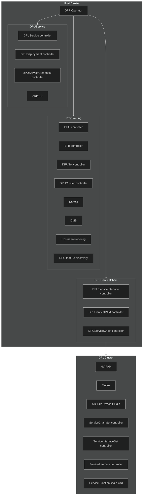
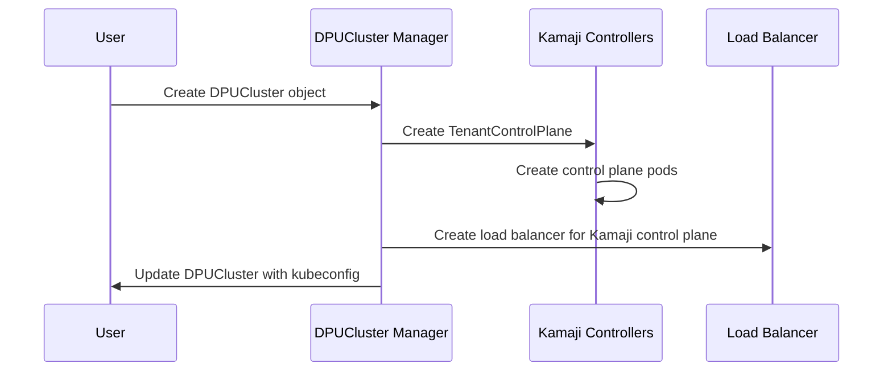
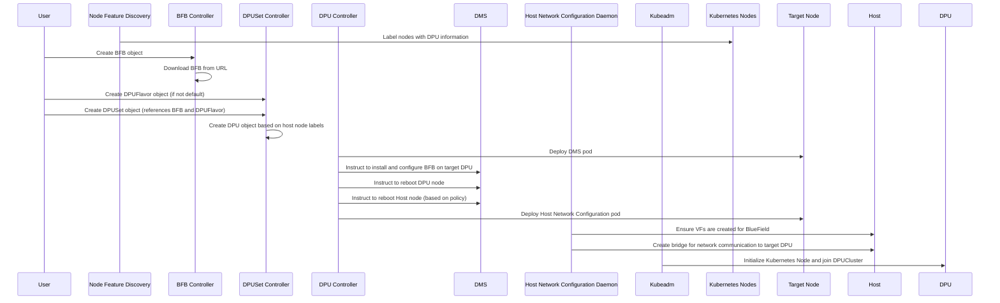
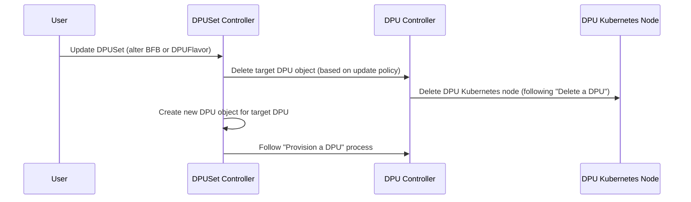
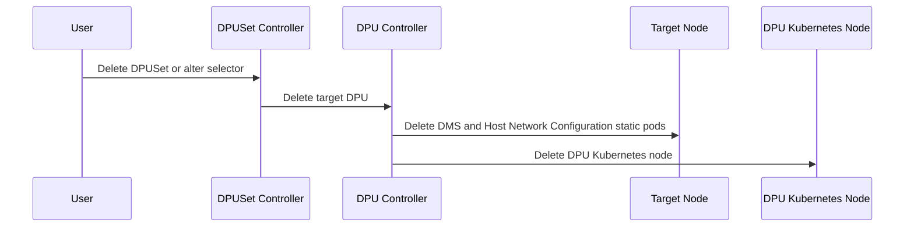
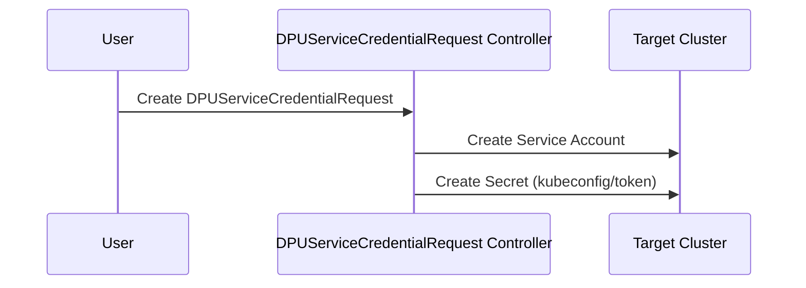
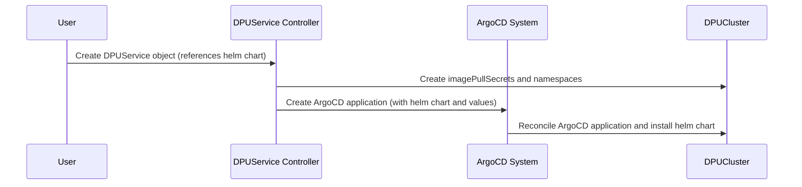
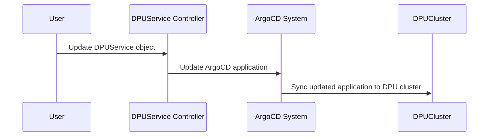
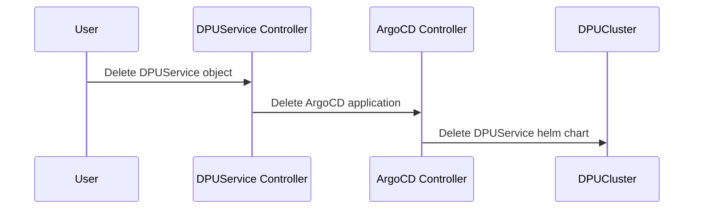

# DOCA Platform Framework

DOCA Platform Framework (DPF) manages NVIDIA DPUs and services running on them in a Kubernetes cluster. A second Kubernetes cluster - called a DPUCluster - manages the lifecycle of services running on the DPUs. This is a high-level overview of the components and flows of the DPF system. For more detailed information on setup and usage - including dependencies and prerequisites - see the installation guide.

<!-- toc -->
- [DPF system components](#dpf-system-components)
- [Provisioning components](#provisioning-components)
    - [In the host cluster control plane](#in-the-host-cluster-control-plane)
    - [On each node in the host cluster](#on-each-node-in-the-host-cluster)
- [DPUService components](#dpuservice-components)
    - [In the host cluster control plane](#in-the-host-cluster-control-plane-1)
- [DPUServiceChain components](#dpuservicechain-components)
    - [In the host cluster control plane](#in-the-host-cluster-control-plane-2)
    - [In the DPU cluster control plane](#in-the-dpu-cluster-control-plane)
    - [On each node in the DPU cluster](#on-each-node-in-the-dpu-cluster)
- [Provisioning user flows](#provisioning-user-flows)
  - [Create a DPU Cluster](#create-a-dpu-cluster)
  - [Provision a DPU](#provision-a-dpu)
  - [Update a DPU](#update-a-dpu)
  - [Delete a DPU](#delete-a-dpu)
- [DPUService flow](#dpuservice-flow)
  - [Create a DPUServiceCredentialRequest](#create-a-dpuservicecredentialrequest)
  - [Create DPUService](#create-dpuservice)
  - [Update DPUService](#update-dpuservice)
  - [Delete DPUServices](#delete-dpuservices)
<!-- /toc -->

## DPF system components
DPF is made up of the following sets of components:
- DPF Operator to install and configure the DPF system.
- Provisioning components to manage the lifecycle of the DPUs including OS installation, configuration and Kubernetes Node creation.
- DPUService components to manage the full lifecycle of services running on DPUs.
- DPUServiceChain components to manage the lifecycle of ServiceFunctionChains on DPUs.

## Provisioning components
This component set uses the Kamaji Cluster Manager - but other Cluster managers may be used.
#### In the host cluster control plane
* Kamaji system components - including the DPF Kamaji Cluster manager
  * Manage the lifecycle of a Kamaji pod-based control plane
  * Manage the Kamaji cluster load balancer
  * Communicate with the host control plane and DPU control plane
* BFB controller
  * Download the Bluefield Bitstream (BFB) from a remote server
  * Communicate with the host control plane and remote BFB server
* DPUSet controller
  * Create DPU objects and manage their lifecycle
  * Select a Kubernetes control plane for DPU Cluster nodes to join
  * Communicate with the host control plane
* DPU controller
  * Flash the Bluefield Bitstream to the DPU
  * Communicate with the DOCA Management Service

#### On each node in the host cluster
* Node feature discovery - including DPU Detector
    * Add information about DPUs to the Kubernetes Node representing the host node
    * Communicate with the host control plane and host node filesystem
* DOCA management service
  * Flash a BFB to DPU hardware
  * Communicate with the BlueField DPU and DPU Controller
* Hostnetwork configuration
  * Configure up Virtual Functionss, bridges and routes for Host to DPU communication
  * Communicate with the host node through CLI calls

## DPUService components
#### In the host cluster control plane
* DPUService controller
  * Manage the lifecycle of DPUServices created by users
  * Manage the lifecycle of ArgoCD Applications linked to DPUServices
  * Communicate with the host control plane
* DPUDeployment controller
  * Manage the lifecycle of a group of DPUServices and DPUSets
  * Communicate with the host control plane
* DPUServiceCredential controller
  * Manage authorization and authentication for communication between the host control plane and DPU control plane
  * Communicate with the host control plane and DPU control plane
* ArgoCD system components
  * Manage lifecycle of helm charts on the DPU Cluster
  * Communicate with the host control plane and DPU control plane

## DPUServiceChain components
#### In the host cluster control plane
* DPUServiceInterface controller
  * Manage the lifecycle of DPUServiceInterfaces created by users
  * Communicate with the host control plane and DPU control plane
* DPUServiceIPAM controller
  * Manage the lifecycle of the DPUServiceIPAM created by users
  * Communicate with the host control plane and DPU control plane
* DPUServiceChain controller
  * Manage the lifecycle of the DPUServiceChain created by users
  * Communicate with the host control plane and DPU control plane
#### In the DPU cluster control plane
* NVIPAM
  * Manage allocation of IPs in the DPU cluster
  * Communicate with the DPU control plane
* ServiceChainSet controller
  * Manage the lifecycle of ServiceChainSets on the DPUCluster
  * Create ServiceChain objects for relevant DPU nodes
  * Communicate with the DPU control plane
* ServiceInterfaceSet controller
  * Manage the lifecycle of ServiceInterfaceSets on the DPUCluster
  * Create ServiceInterface objects for relevant DPU nodes
  * Communicate with the DPU control plane
#### On each node in the DPU cluster
* ServiceInterface controller
    * Creates ovs ports on DPU based on ServiceInterface objects
    * Communicate withe the DPU control plane and host OVS
* ServiceChain controller
  * Create ovs flows on DPU based on ServiceChain objects
  * Communicate with the DPU control plane and DPU host OVS
* ServiceFunctionChain CNI
  * Adds ovs network interfaces to pods
  * Communicate with Container Runtime Interface and host OVS
* NVIPAM
  * Allocate IPs for pods on the DPU node
  * Communicate with the DPU control plane and host OS
* Multus
  * Allocate network devices for pods on DPU nodes
  * Communicate with the DPU control plane, Container Runtime Ibnterface and host OS
* SR-IOV Device Plugin
  * Manage the lifecycle of Virtual Functions on the DPU node
  * Communicate with the host OS and Kubelet

## Provisioning user flows

DPF provisioning has four principle user flows.

### Create a DPU Cluster

This is a prerequisite to provision a DPU with DPF. This flow is based on the Kamaji Cluster Manager - but other Cluster managers may be used.
1) The user creates a DPUCluster object.
2) The DPUCluster manager creates an underlying Kamaji TenantControlPlane.
3) The Kamaji controllers create the cluster control plane pods.
4) The DPUCluster manager creates a load balancer for the Kamaji control plane.
5) The DPUCluster manager updates the DPUCluster with a kubeconfig for the Kamaji control plane. 

### Provision a DPU

1) Node Feature Discovery labels Kubernetes nodes with DPU information.
2) The user creates a BFB object.
3) The BFB controller downloads the BFB from a URL.
4) The user creates a DPUFlavor object if not using a default.
5) The user creates a DPUSet object which references both the BFB and the DPUFlavor.
6) The DPUSet controller creates a DPU object based on host node labels.
7) The DPU controller deploys DMS pod to a target node.
8) The DPU controller instructs DMS to install and configure the BFB on a target DPU.
9) The DPU controller instructs DMS to reboot the DPU node.
10) The DPU controller instructs DMS to reboot the Host node based on reboot policy.
11) The DPU controller deploys the Host Network Configuration pod on a target node.
12) The Host Network Configuration daemon ensures VFs are created on the host for the BlueField.
13) The Host Network Configuration daemon creates a bridge for network communication to the target DPU..
14) Kubeadm initializes a Kubernetes Node on the DPU and joins the DPUCluster.

### Update a DPU

1) User updates the DPUSet altering its the BFB or DPUFlavor.
2) DPUSet controller deletes the target DPU object based on update policy rules.
3) DPU controller deletes the DPU Kubernetes node following `Delete a DPU`.
4) DPUSet controller creates a new DPU object for the target DPU.
5) The process in `Provision a DPU` is followed to create a new DPU node with the updated DPU system.

### Delete a DPU

1) User deletes the DPUSet or alters the selector to reduce the number of DPU objects.
2) DPUSet controller deletes target DPU.
3) DPU controller deletes the DMS and Host Network Configuration static pods.
4) DPU controller deletes the DPU Kubernetes node.

## DPUService flow
DPUService orchestration has four principle user flows.

### Create a DPUServiceCredentialRequest

This is a prerequisite for DPUServices that are deployed in the host control plane but communicate with the DPU control plane and vice versa. Users must modify their DPUService to use the secret created by the DPUServiceCredentialRequest.
1) User creates a DPUServiceCredentialRequest
2) DPUServiceCredentialRequest controller creates a service account in the target cluster.
3) DPUServiceCredentialRequest controller creates a secret with either a kubeconfig or token for the service account.

### Create DPUService

1) User creates a DPUService object referencing a helm chart in a repository.
2) DPUService controller creates associated imagePullSecrets and namespaces in the DPUCluster.
3) DPUService controller creates an ArgoCD application with the DPUService helm chart and values.
4) ArgoCD system reconciles the ArgoCD application and installs the helm chart to the DPU cluster.

### Update DPUService

1) User updates the DPUService object.
2) DPUService controller updates the ArgoCD application.
3) ArgoCD system components sync the updated application to the DPU cluster.

### Delete DPUServices

1) User deletes the DPUService object.
2) DPUService controller deletes the ArgoCD application.
3) ArgoCD controller deletes the DPUService helm chart in the DPU cluster.

TODO: DPUDeployment flow

TODO: DPUServiceInterface flow