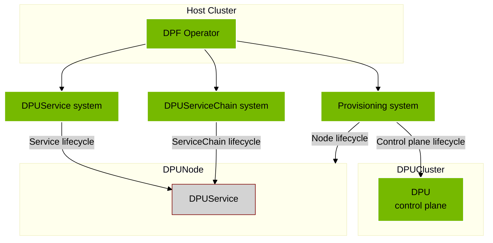
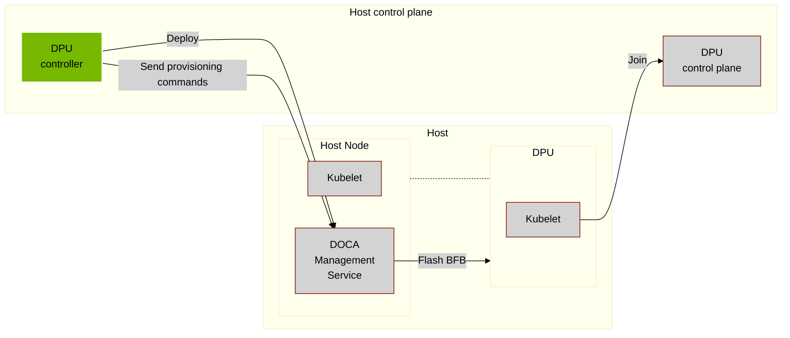
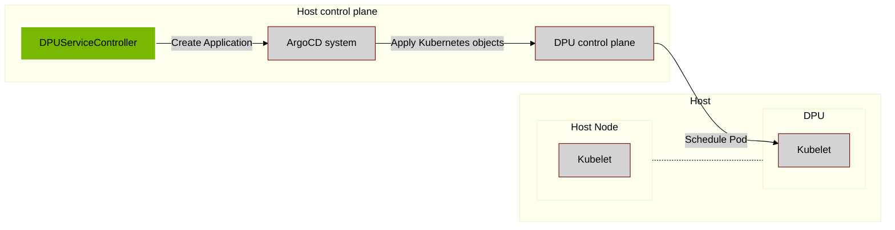
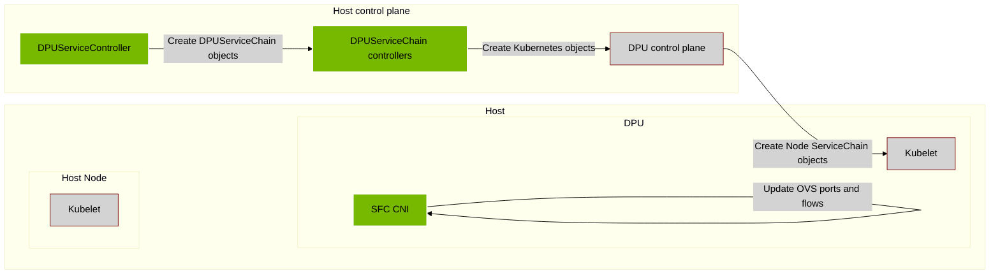
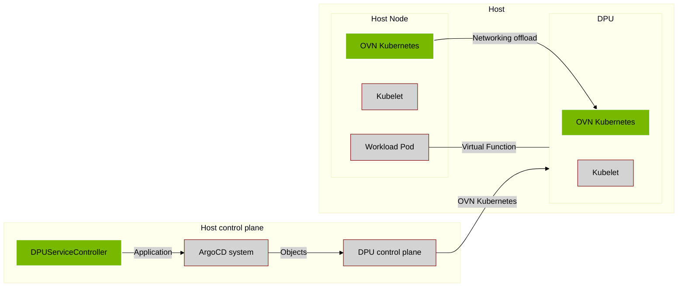

## DOCA Platform Framework

A system for provisioning and managing DPUs and the DOCA services that run on them. Enable DPUs and DOCA Services deployment and management at scale.

---

## Provisioning system
Manage the lifecycle of the DPU hardware and its Kubernetes orchestration system.

1. User creates a `DPUSet` and `BFB` object representing a set of DPUs they want to run services on.
2. DPUSet controller creates a `DPU` object based on the DPUSet NodeSelector.
3. DPU controller deploys DMS and communicates the BFB and other configuration to it.
4. DMS installs BFB to the DPU over rshim.
5. The DPU node joins the DPU Control plane .

---

## DPUService system
Orchestrate DOCA Services to run on DPUs.

1. User creates a `DPUService` referencing a helm chart.
2. DPUService controller creates an ArgoCD Application representing the DPUService.
3. ArgoCD system syncs the Application to the DPU Cluster.
4. A Pod for the `DPUService` runs on the DPU Node.

---

## DPUServiceChain system
Orchestrate Service Chains for advanced network flows through DPUs.

1. User creates `DPUServiceInterface`, `DPUServiceChain`, `DPUServiceIPAM` representing ovs ports, ovs flows and CNI IPAM.
2. Service Function Chain controllers sync these objects to the DPUCluster.
3. ServiceInterface controller creates OVS ports for the Service Function Chain
4. ServiceChain controller creates OVS flows for the Service Function Chain
5. NVIPAM allocates an IP Pool for the Service Function Chain
6. User creates a DPUService for the ServiceFunctionChain

---

## OVN Kubernetes DPUService
Offload primary and secondary network to the DPU

1. User deploys OVN Kubernetes as the primary CNI
2. User creates OVN Kubernetes `DPUService`
3. DPUService controller and ArgoCD sync the OVNKubernetes DPUService to the DPUNode
4. OVN is the primary network which links workload pods with the ServiceFunctionChains operating on the DPU node
5. All pods get a VF from the Bluefield which is used for the primary network
6. OVN processing offloaded to DPU
7. Other network functions - like an L3 firewall using HBN - can be added to the service chain for a pod.