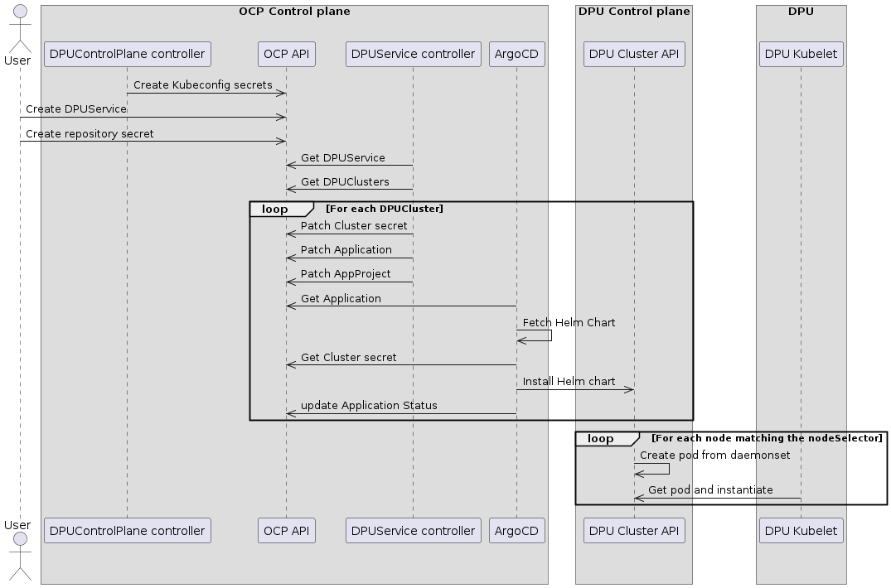

## DPUService Controller
The DPUService controller is responsible for reconciling DPUService objects in the host cluster. It is a single controller which is responsible for managing the lifecycle of the following objects:
- DPUService
- ArgoCD AppProject
- ArgoCD Application
- ArgoCD Secret

## Scope
The scope of this design is the design of the DPUService API, the controller that will act on that API and the controller's interactions with other components.

### Out of scope
#### Complex upgrades
- **Complex upgrades**: This design omits considerations from the architecture document that rely on the Node Maintenance controller. Upgrades are assumed to be simple, handled by ArgoCD, and not require a node restart.
- **ArgoCD configuration**: This design omits considerations of the exact configuration of ArgoCD.
- **Multi-cluster service management**: This design implements multi-cluster DPUServices, but treats each cluster as essentially independent.
- **Service Function Chains**: This design propagates metadata but makes no other considerations for Service Function Chains.
- **Provisioning**: This design omits considerations of how or if Kubernetes clusters and nodes are available.

### Prerequisites
The following is a set of pre-requisites that are out of scope for this design. Each of these must be satisfied for the DPUService controller to successfully reconcile objects.
- A host cluster to run the controller.
- ArgoCD on the host cluster in a well-known namespace.
- One or more available DPU Clusters as destinations for ArgoCD.
- An inventory of those clusters available in the host cluster API.
- A kubeconfig for each of those clusters available in the host cluster API.

## API 

The DPUService controller operates on a DPUService object. The DPUService is based on a contract for the helm chart it references. 

This contract sets out that the helm chart contains:
* At most one pod templates that is part of a Service Function Chain
* A daemonset that deploy the pod with the Service Function Chain
* A value `serviceDaemonSet.labels map[string]string` to add labels to every object deployed in the DPUService.
* A value `serviceDaemonSet.annotations map[string]string` to add annotations to every object deployed in the DPUService.
* A value `serviceDaemonSet.nodeSelector metav1.LabelSelector` to add a nodeSelector to the DaemonSet.
* A value `serviceDaemonSet.resources map[ResourceName]resource.Quantity` to add resources to the DaemonSet.
* A value `serviceDaemonSet.updateStrategy corev1.DaemonSetUpdateStrategy` to add an updateStrategy to the DaemonSet.
* A value `serviceID` to add a label identifying the Service Function Chain to the Pods.

### Spec
```yaml 
apiVersion: svc.dpu.nvidia.com/v1alpha1
kind: DPUService
metadata:
  name: dpu-service-name
  namespace: default
spec:
  source:
    repoURL: https://helm.ngc.nvidia.com/nvidia
    version: v1.1.1
    chart: dpu-service-name
  values:
    arbitrary-value-one: "value"
  serviceID: dpu-service-function-chain-ID
  serviceDaemonSet:
    nodeSelector:
        matchLabels:
          dpu.nvidia.com/dpu-label: dpu
        matchExpressions:
          - { key: tier, operator: In, values: [critical-dpus] }
    resources:
        requests:
          cpu: 1
        limits:
          cpu: 1
    updateStrategy:
        type: RollingUpdate
        rollingUpdate:
          maxUnavailable: 1
    labels:
      arbitrary-labels: my-app-label
    annotations:
      arbitrary-annotation: my-app-annotation
```

### Status
The Status of the DPUService is a consolidated summary of the state of the DPUService across each cluster.

Note: This section of the design is underspecified. The status below contains almost every field from the `.status` of the ArgoCD Application in a per-cluster map[string]StatusField.
```yaml
status:
  # Resources is a list of Kubernetes resources managed by this application
  resources map[string][]ResourceStatus `json:"resources,omitempty" protobuf:"bytes,1,opt,name=resources"`
  # Sync contains information about the application's current sync status
  sync map[string]SyncStatus `json:"sync,omitempty" protobuf:"bytes,2,opt,name=sync"`
  # Health contains information about the application's current health status
  health map[string]HealthStatus `json:"health,omitempty" protobuf:"bytes,3,opt,name=health"`
  # History contains information about the application's sync history
  history map[string]RevisionHistories `json:"history,omitempty" protobuf:"bytes,4,opt,name=history"`
  # Conditions is a list of currently observed application conditions
  conditions map[string][]ApplicationCondition `json:"conditions,omitempty" protobuf:"bytes,5,opt,name=conditions"`
  # ReconciledAt indicates when the application state was reconciled using the latest git version
  reconciledAt map[string]*metav1.Time `json:"reconciledAt,omitempty" protobuf:"bytes,6,opt,name=reconciledAt"`
  # OperationState contains information about any ongoing operations, such as a sync
  OperationState map[string]*OperationState `json:"operationState,omitempty" protobuf:"bytes,7,opt,name=operationState"`
  # SourceType specifies the type of this application
  sourceType map[string]ApplicationSourceType `json:"sourceType,omitempty" protobuf:"bytes,9,opt,name=sourceType"`
  # Summary contains a list of URLs and container images used by this application
  summary map[string]ApplicationSummary `json:"summary,omitempty" protobuf:"bytes,10,opt,name=summary"`
```

## Controller flow


### 1. Reconcile deletion if needed.
   - actively delete the Applications.
   - remove DPUService finalizer if it exists.
   - Cleanup of the ArgoCD `Secret` and `AppProject` is delegated to Kubernetes OwnerReferences. 

### 2. Add DPUService finalizer to the DPUService.

### 3. Retrieve the list of DPUClusters from the host API.
   - If one or more DPUClusters is not ready add a condition to the DPUService.

### 4. Reconcile the secrets for each cluster.
   - Note: One set of ArgoCD `Secrets` is shared by all DPUServices so this will be a no-op in most circumstances.
   - For each DPUCluster retrieve a secret and convert it to secret Argo can use.
   - Create or patch the secret.
   - If there is an error report it as a condition.

The ArgoCD Secret - one for each cluster - looks similar to:

```yaml
apiVersion: v1
kind: Secret
metadata:
  name: dpu-cluster-01-argocd
  namespace: dpf-argo-cd-system
  labels:
    argocd.argoproj.io/secret-type: cluster
  ownerReferences:
    - name: dpu-service-name-01
    - name: dpu-service-name-02
type: Opaque
stringData:
  name: dpu-cluster-01
  server: $SERVER
  config: |
    {
      "tlsClientConfig": {
        "caData": $DATA,
        "certData": $DATA,
        "keyData": $DATA
      }
    }
```

### 5. Reconcile the ArgoCD `AppProject`
   - Note: One ArgoCD `AppProject` is shared by all DPUServices so this will be a no-op in most circumstances.
   - Create an AppProject with the correct list of `Desitinations.server`. This is the set of DPU Clusters that ArgoCD targets.
   - Create or patch the `AppProject`
   - Return errors and a summarized status for the AppProject.

The resulting ArgoCD `AppProject` looks similar to:
```yaml
apiVersion: argoproj.io/v1alpha1
kind: AppProject
metadata:
  name: doca-platform-framework
  namespace: dpf-argo-cd-system
  finalizers:
  - resources-finalizer.argocd.argoproj.io
  ownerReferences:
    - name: dpu-service-name-01
    - name: dpu-service-name-02
spec:
  destinations:
  - server: https://1.1.1.2:6443
    namespace: '*'
  - server: https://1.1.1.3:6443
    namespace: '*'
  - server: https://1.1.1.4:6443
    namespace: '*'
  sourceRepos:
  - '*'
  clusterResourceWhitelist:
  - group: '*'
    kind: '*'
```

### 6. Reconcile the ArgoCD `Applications`
   - For each DPUCluster:
     - Convert the DPUService to an Application for each DPUCluster using the following rules:
       - The name is the DPUService name with a numerical suffix matching the DPUCluster name suffix.
       - Labels are added with the DPUService name and DPUCluster name.
       `.spec`:
       - `.project` is the name of the single DPF `AppProject`
         - `.destination` is the server of the DPUCluster
         `.source`:
         - `.repoURL`, `.version` and `.chart` are copied from DPUService `.spec.source` `.repoURL`, `.version` and `.chart`
           `.helm.valuesObject`
           - `.serviceDaemonSet.nodeSelector` is from DPUService `.spec.serviceDaemonSet.NodeSelector`
           - `.serviceDaemonSet.labels` is from DPUService `.spec.serviceDaemonSet.Labels`
           - `.serviceDaemonSet.annotations` is from DPUService `.spec.serviceDaemonSet.Annotations`
           - `.serviceDaemonSet.updateStrategy` is from DPUService `.spec.serviceDaemonSet.updateStrategy`
           - `.serviceDaemonSet.resources` is from DPUService `.spec.serviceDaemonSet.resources`
           - other values are from `.spec.values`
     - Create or patch each Application.
   - Return errors and a summarized status for each Application.

```yaml
apiVersion: argoproj.io/v1alpha1
kind: Application
metadata:
  name: dpu-service-name-$CLUSTER_NUMBER-SUFFIX # Templated name from DPUService name + cluster number suffix.
  namespace: dpf-argo-cd-system
  labels:
    - "dpu.nvidia.com/cluster-name": "dpu-cluster-01" # Labels added by controller.
    - "dpu.nvidia.com/dpu-service-name": "dpu-service-name"
  finalizers:
    - resources-finalizer.argocd.argoproj.io
spec:
  project: doca-platform-framework # Static name.
  destination: # Added by controller.
    - server: https://1.1.1.2:6443
      namespace: default
  source:
    repoURL: https://helm.ngc.nvidia.com/nvidia # From DPUService `.spec.source.repoURL`
    targetRevision: v1.1.1 # From DPUService `.spec.source.version`
    chart: dpu-service-name #From DPUService `.spec.source.targetRevision`
    helm:
      valuesObject:
        dpu-service-value-one: "value" # From DPUService `.spec.values`
        serviceDaemonSet:
            nodeSelector: # From DPUService `.spec.serviceDaemonSet.nodeSelector`
              matchLabels:
                dpu.nvidia.com/dpu-label: dpu
              matchExpressions:
                - { key: tier, operator: In, values: [critical-dpus] }
            labels: # From DPUService `.spec.serviceDaemonSetlabels`
              service-ID: service-one # From DPUService `.spec.serviceID`
              arbitrary-labels: my-app-label
            annotations: # From DPUService `.spec.serviceDaemonSet.annotations`
              arbitrary-annotation: my-app-annotation
              daemonSetUpdateStrategy:
            updateStrategy: # From DPUService `.spec.serviceDaemonSet.updateStrategy`
              type: RollingUpdate
              rollingUpdate:
                maxUnavailable: 1
            resources: # From DPUService `.spec.serviceDaemonSet.resources`
              requests:
                cpu: 1
              limits:
                cpu: 1
```

### 7. Reconcile the status of the DPUService
   - There are a number of items to add to the Status of the DPUService at this point:
     - Outcome of deletion - whether it's pending or there are errors.
     - Whether the DPUClusters are healthy.
     - Whether the ArgoCD `Secrets` have been successfully reconciled.
     - Whether the ArgoCD `AppProject` has been successfully reconciled and their current conditions.
     - Whether the ArgoCD `Applications` have been successfully reconciled and their current conditions.

### 8. Patch the DPUService
   - Roll up the changeset from the full reconcile - status, metadata etc. into a single patch and update the DPUService. 

## Validation
- Each field in the DPUService will be validated in the same way as the underlying ArgoCD field or underlying Kubernetes type. This validation will either be done by OpenAPI validations or through a webhook.
- There is no validation of the contents of the chart in this design. If the helm chart is invalid it will not be deployed correctly by the ArgoCD Application. Depending on the exact type of error this could lead to unexpected behaviour in the deployed application. The DPUService controller could use features of ArgoCD to prevent Kubernetes objects from being deployed.

## Failures
The DPUService controller is tolerant of failures taking place in the underlying DPU Clusters. If it can not reach the DPU Cluster API it will report that information as a condition. It will continue to update the all objects in its normal reconcile flow so as to prevent a deadlock - i.e. a situation where one cluster being down prevents DPUServices from other Clusters from being updated.

## Multi-cluster considerations

### Approach
- The DPUService controller will rely on ArgoCD to manage client connections to the DPU Clusters.
- This can be done either by creating an `Application` per-cluster or by creating an `ApplicationSet`
  - The Application was chosen over the ApplicationSet in this design as the features of the ApplicationSet - which mostly revolve around go templating - aren't particularly useful in this case. We have a limited number of variables for a single ArgoCD `AppProject` and we can place them directly using go code. This decision can be revisited at a later date if needed.
- The Service Function Chain controller will also have to manage multi-cluster cases.
  - This could also be done using ArgoCD so we don't have two separate approaches to applying objects to the DPU Clusters.
  - Out of scope for this design document.

### Kubernetes limitations
- Many Kubernetes objects will not behave as expected when deployed in a single DPUService across multiple DPU Clusters. For example:
  - Pods will not be able to connect with each other across clusters.
  - Services will only work for pods in a single cluster.
  - Deployments will have the wrong replica count - i.e. `spec.replicas` X `$NUM_OF_CLUSTERS`
Solving these issues is out of scope for this document, but users should be made fully aware of the limitations of this multi-cluster approach. This could be done through validation - e.g. disallowing `Deployment` types in the package deployed by a DPUService or through documentation.