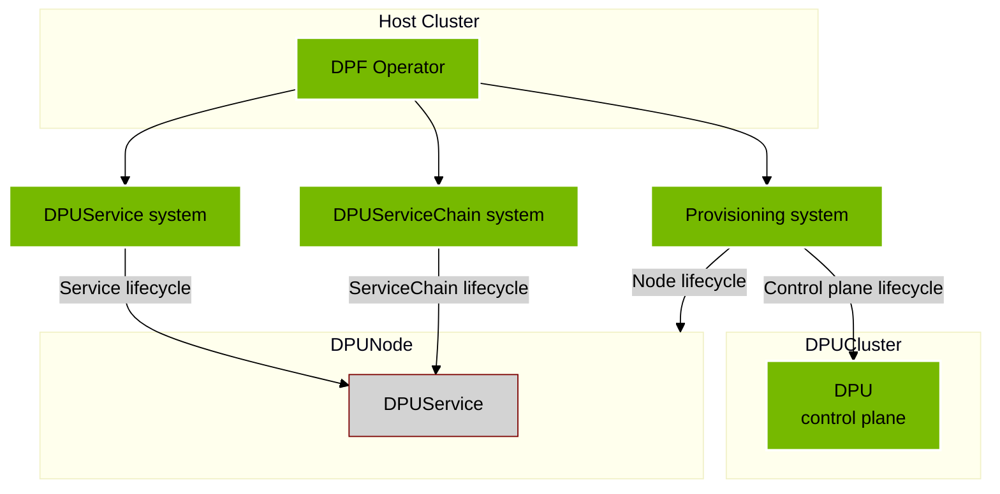
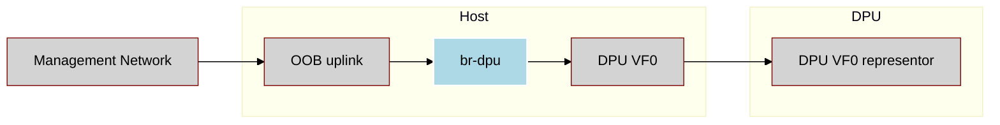
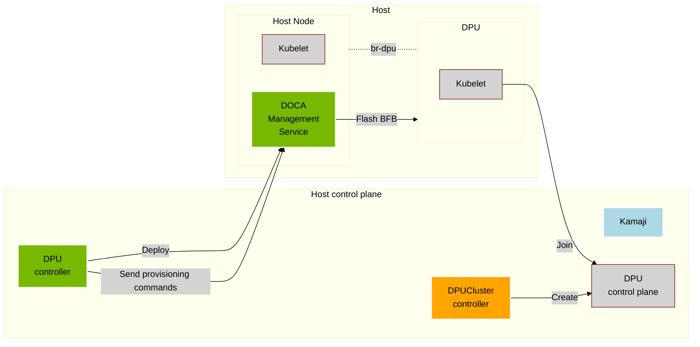
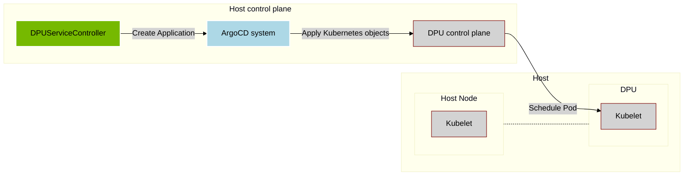
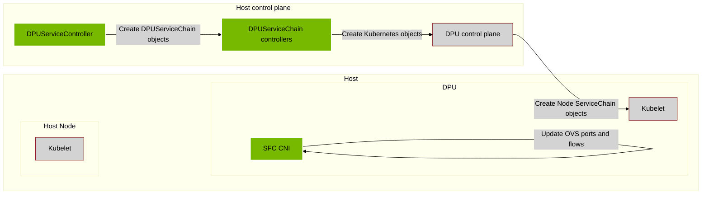

## DOCA Platform Foundation

Independent software vendors (ISVs) can integrate DOCA Platform Foundation (DPF). Integration may involve modifying or replacing dependencies and components used in the upstream version of DPF.

The below details the system highlighting which components can be changed in integration.

## DPF operator

The DPF Operator has a number of dependencies which can be swapped out during integration in favor of solutions managed by the integrator. Replacing some of these components may require additional modification - i.e. certificate management with a tool other than cert manager may require changes to the deployments.

Today the following are either mentioned in the installation guide or installed as dependencies from the DPF Operator helm chart.

- certificate management using `cert-manager`
- storage provisioning using `NFS` and `local-path` provisioner
- NVIDIA Network Operator
- SR-IOV Network Operator
- NVIDIA Node maintenance operator.

## Host networking configuration

DPF relies on each worker node having a specific networking configuration. In this configuration the worker node management interface is plugged into a bridge called `br-dpu`. Virtual functions from the BlueField DPU are added to the same bridge.

This networking pattern must be implemented when integrating DPF. There is no component in DPF which configures this. For more information on the implementation details see the [host networking prerequisites](../guides/usecases/host-network-configuration-prerequisite.md).

## Provisioning system
Manage the lifecycle of the DPU hardware and its Kubernetes orchestration system.

The following components are used in upstream DPF and can be modified or replaced during integration:
- DPU Cluster manager- highlighted in orange - can be replaced in full in integration.
- Kamaji controller - a dependency of the DPUCluster manager - can be replaced.

For more information on implementing a DPUCluster manager see [the DPUCluster documentation](../guides/dpucluster.md).

## DPUService system

Orchestrate DOCA Services to run on DPUs.

The following components are used in upstream DPF and can be modified or replaced during integration:
- ArgoCD - a dependency of the DPUService controller manager can be replaced with a managed version of ArgoCD

## DPUServiceChain system
Orchestrate Service Chains for advanced network flows through DPUs.

None of the components used in Service chain orchestration should be replaced during integration.
