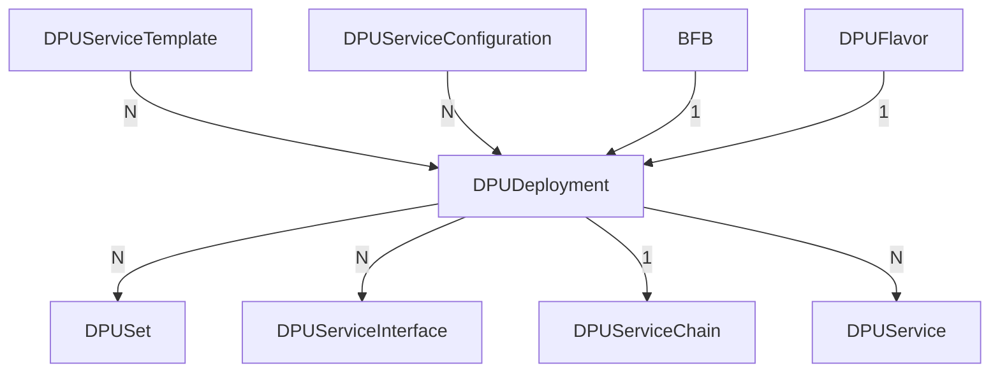

# Working with the DPUDeployment Custom Resource

<!-- toc -->
- [Capabilities](#capabilities)
- [Created Child Custom Resources](#created-child-custom-resources)
- [Prerequisite Custom Resources With Examples](#prerequisite-custom-resources-with-examples)
  - [DPUServiceTemplate](#dpuservicetemplate)
  - [DPUServiceConfiguration](#dpuserviceconfiguration)
  - [DPUFlavor](#dpuflavor)
  - [BFB](#bfb)
- [DPUDeployment Example](#dpudeployment-example)
- [DPUDeployment Updates](#dpudeployment-updates)
  - [Non-disruptive DPUService Update](#non-disruptive-dpuservice-update)
  - [Disruptive DPUService Update](#disruptive-dpuservice-update)
- [DPUService and BFB version matching](#dpuservice-and-bfb-version-matching)
<!-- /toc -->

This document describes how a user can work with the `DPUDeployment` Custom Resource.
A `DPUDeployment` describes a set of `DPUServices` and a `DPUServiceChain` that run
on a set of DPUs with a given `BFB` and `DPUFlavor`.



Throughout this document, there are examples for the required Custom Resources that
end up building a valid `DPUDeployment` Custom Resource. These examples contain comments
related to fields that are set for more context. The theoretical example is about
2 services, one of them producing work and the other one executing work (producer-consumer problem).

## Capabilities

- Validates dependencies to ensure that they are configured correctly and reports
  errors in the `DPUDeployment` status conditions accordingly.
- Validates that requested `DPUService` resources fit the DPUs they are targeting
  and report errors in the `DPUDeployment` status conditions accordingly.
- Validates that the version requirements of the `DPUService` fit the versions
  found in the given `BFB` and reports errors in the `DPUDeployment` status conditions
  accordingly.
- Gracefully handles synchronized disruptive and non-disruptive updates of the underlying
  objects.

## Created Child Custom Resources

When applying a valid `DPUDeployment` that has all of its dependencies set correctly
and available, there will be a couple of objects that are going to be created automatically:

- `DPUSet`: Deploys a given `BFB` with configuration provided by the given `DPUFlavor`
  to the target `DPUs`. A `DPUDeployment` may create multiple such objects, depending
  on what is specified in its `spec`.
- `DPUServiceInterface`: Used to construct a Service Chain on the DPU. A `DPUDeployment`
  may create multiple such objects, depending on what is specified in the [DPUServiceConfiguration](#dpuserviceconfiguration).
- `DPUServiceChain`: Used to define a Service Chain on the DPU that references the
  interfaces created above. A `DPUDeployment` creates a single `DPUServiceChain`.
- `DPUService`: Deploys a service as Pod in each DPU. A `DPUDeployment` may create
  multiple such objects, depending on what is specified in its `spec`.

## Prerequisite Custom Resources With Examples

There are several Custom Resources that are required in order to make use of the
`DPUDeployment`. These are:

- [DPUServiceTemplate](#dpuservicetemplate)
- [DPUServiceConfiguration](#dpuserviceconfiguration)
- [DPUFlavor](#dpuflavor)
- [BFB](#bfb)

### DPUServiceTemplate

A `DPUServiceTemplate` contains configuration options related to resources required
by the `DPUService` to be deployed. This Custom Resource is usually provided by NVIDIA
for the supported `DPUServices` that are published. It helps generate the underlying
`DPUService`. It is the base configuration for the `DPUService` that is getting merged
with configuration provided by the `DPUServiceConfiguration`. If there is a conflict,
settings in `DPUServiceConfiguration` take precedence.

A user must create as many `DPUServiceTemplate` Custom Resources as the number of
services they aim to deploy using a `DPUDeployment`. In this example, we will need
to create 2 of those since we have 2 `DPUServices`.

```yaml
---
apiVersion: svc.dpu.nvidia.com/v1alpha1
kind: DPUServiceTemplate
metadata:
  name: producer
  namespace: customer-namespace
spec:
  deploymentServiceName: "producer" # Must match the key in the `dpudeployment.spec.services`
  helmChart:
    source:
      repoURL: https://example.com/charts
      path: producer
      version: v0.0.1
    # The `DPUServiceTemplate` owner should specify requests and limits for the actual containers. The
    # `DPUServiceTemplate` owner is responsible to ensure that those resources are not exceeding the specified
    # `resourceRequirements` field. Notice that setting resources on containers may be different per Helm Chart
    # implementation.
    values:
      container1:
        resources:
          requests:
            cpu: 0.2
            memory: 0.2Gi
            nvidia.com/sf: 1
          limits:
            cpu: 0.4
            memory: 0.4Gi
            nvidia.com/sf: 1
      container2:
        resources:
          limits:
            cpu: 0.6
            memory: 0.6Gi
  # resourceRequirements contains the overall resources required by this particular service to run on a single node
  # This is the field that is considered when scheduling a `DPUDeployment`.
  resourceRequirements:
    cpu: 1
    memory: 1Gi
    nvidia.com/sf: 1
---
apiVersion: svc.dpu.nvidia.com/v1alpha1
kind: DPUServiceTemplate
metadata:
  name: consumer
  namespace: customer-namespace
spec:
  deploymentServiceName: "consumer"
  helmChart:
    source:
      repoURL: https://example.com/charts
      path: consumer
      version: v0.0.1
    values:
      worker:
        parallelization: 5
        resources:
          requests:
            cpu: 1
            memory: 1Gi
            nvidia.com/sf: 1
          limits:
            cpu: 1
            memory: 2Gi
            nvidia.com/sf: 1
  resourceRequirements:
    cpu: 2
    memory: 4Gi
    nvidia.com/sf: 1
```

### DPUServiceConfiguration

A `DPUServiceConfiguration` contains all configuration options from the user to be
provided to the `DPUService` via the Helm values. This Custom Resource is usually
crafted by the user according to their environment and intended use of the `DPUService`.
It helps generate the underlying `DPUService`. It is a layer on top of the configuration
defined in the `DPUServiceTemplate`. This configuration is getting merged with
configuration provided by the `DPUServiceTemplate`. If there is a conflict, settings
in `DPUServiceConfiguration` take precedence.

A user must create as many `DPUServiceConfiguration` Custom Resources as the number
of services they aim to deploy using a `DPUDeployment`. In this example, we will
need to create 2 of those since we have 2 `DPUServices`.

```yaml
---
apiVersion: svc.dpu.nvidia.com/v1alpha1
kind: DPUServiceConfiguration
metadata:
  name: producer
  namespace: customer-namespace
spec:
  deploymentServiceName: "producer" # Must match the key in the `dpudeployment.spec.services`
  serviceConfiguration:
    serviceDaemonSet:
      labels:
        sre.nvidia.com/service-tier: "t1"
      annotations:
        sre.nvidia.com/page: "false"
  interfaces:
  - name: app-iface
    network: mynad
---
apiVersion: svc.dpu.nvidia.com/v1alpha1
kind: DPUServiceConfiguration
metadata:
  name: consumer
  namespace: customer-namespace
spec:
  deploymentServiceName: "consumer"
  serviceConfiguration:
    # The `DPUServiceConfiguration` owner may choose to override some of the settings defined by the
    # `DPUServiceTemplate` or add new. It is not recommended to change container resources in this resource but rather
    # in DPUServiceTemplate.
    helmChart:
      values:
        worker:
          parallelization: 10
    serviceDaemonSet:
      labels:
        sre.nvidia.com/service-tier: "t1"
      annotations:
        sre.nvidia.com/page: "true"
  # interfaces describes the network each interface of this application needs to be attached to so that it can function
  # and be available for use in the Service Chain framework.
  interfaces:
  - name: app-iface
    network: mynad
```

### DPUFlavor

A `DPUFlavor` describes the configuration to be applied on the DPU during the provisioning.
This is a very minimal `DPUFlavor` as the purpose of this document is to demonstrate
the capabilities of the `DPUDeployment`. Given that, there are 2 fields set that are
related to the `DPUDeployment`.

```yaml
apiVersion: provisioning.dpu.nvidia.com/v1alpha1
kind: DPUFlavor
metadata:
  name: producer-consumer
  namespace: customer-namespace
spec:
  # dpuResources indicates the minimum amount of resources needed for a BFB with that flavor to be installed on a
  # DPU. Using this field, the controller can understand if that flavor can be installed on a particular DPU. It
  # should be set to the total amount of resources the system needs + the resources that should be made available for
  # DPUServices to consume.
  dpuResources:
    cpu: 16
    memory: 16Gi
    nvidia.com/sf: 20
  # systemReservedResources indicates the resources that are consumed by the system (OS, OVS, DPF system etc) and are
  # not made available for DPUServices to consume. DPUServices can consume the difference between DPUResources and
  # SystemReservedResources. This field must not be specified if dpuResources are not specified.
  systemReservedResources:
    cpu: 4
    memory: 4Gi
    nvidia.com/sf: 4
```

The above configuration translates to the following resources being available for
the `DPUServices` deployed by the `DPUDeployment`.

```yaml
allocatableResources:
  cpu: 12
  memory: 12Gi
  nvidia.com/sf: 16
```

### BFB

A `BFB` describes the BFB to be flashed on the DPU during the provisioning.

```yaml
apiVersion: provisioning.dpu.nvidia.com/v1alpha1
kind: BFB
metadata:
  name: bfb-2.9
  namespace: customer-namespace
spec:
  fileName: "bfb-2.9.0.bfb"
  url: "http://internal-nfs/bf-bundle-2.9.0-33_24.04_ubuntu-22.04_unsigned.bfb"
```

## DPUDeployment Example

The following `DPUDeployment` example is based on the Custom Resources found above.
It describes a `DPUDeployment` which targets 2 sets of DPUs, provisioned with a specific
`DPUFlavor` and `BFB`, and all of them running 2 `DPUServices`.

```yaml
apiVersion: svc.dpu.nvidia.com/v1alpha1
kind: DPUDeployment
metadata:
  name: producer-consumer
  namespace: customer-namespace
spec:
  dpus:
    # bfb references the `BFB` object
    bfb: "bfb-2.9"
    # flavor references the `DPUFlavor` Custom Resource
    flavor: "producer-consumer"
    # dpuSets enables the user to select the DPUs this `DPUDeployment` should deploy to. It's a list so that the user
    # can be as flexible as possible. In this example, we theoretical target Hosts in 2 different racks, and we target
    # the DPUs that have the specified PCI address.
    dpuSets:
    - nameSuffix: "dpuset1"
      nodeSelector:
        matchLabels:
          datacenter.nvidia.com/rack: "b-100"
      dpuSelector:
        pciAddr: "0000:0e:00.0"
    - nameSuffix: "dpuset2"
      nodeSelector:
        matchLabels:
          datacenter.nvidia.com/rack: "b-101"
      dpuSelector:
        pciAddr: "0000:1a:00.0"
  # services reflects the `DPUServices` that should be deployed on those DPUs. The key of this map is the service name
  # and the value is referencing the respective `DPUServiceTemplate` and `DPUServiceConfiguration` for that each service.
  services:
    producer:
      serviceTemplate: "producer"
      serviceConfiguration: "producer"
    consumer:
      serviceTemplate: "consumer"
      serviceConfiguration: "consumer"
  # serviceChains defines the `DPUServiceChain` that should be created as part of this `DPUDeployment`.
  serviceChains:
  - ports:
    - service:
        name: producer # The value must match the key in the `spec.services`
        interface: app-iface # The value must match the `dpuserviceconfiguration.spec.interfaces[].name`
    - service:
        name: consumer
        interface: app-iface
   #  Notice that the user can also reference other DPUServiceInterfaces that may already exist or are created manually
   #  by the user by specifying an entry like the one that follows:
   # - serviceInterface:
   #     matchLabels:
   #       svc.dpu.nvidia.com/interface: p0
```

As mentioned in the [Created Child Custom Resources](#created-child-custom-resources)
section, after applying this manifest, the following objects are created:

```bash
$ kubectl get dpuset -A
NAMESPACE            NAME                      AGE
customer-namespace   producer-consumer-dpuset1   36m
customer-namespace   producer-consumer-dpuset2   36m

$ kubectl get dpuset -n customer-namespace
NAME                      AGE
producer-consumer-dpuset1   36m
producer-consumer-dpuset2  36m

$ kubectl get dpuserviceinterface -n customer-namespace
NAME                                   IFTYPE    IFNAME      AGE
producer-consumer-consumer-app-iface   service   app-iface   36m
producer-consumer-producer-app-iface   service   app-iface   36m

$ kubectl get dpuservicechain -n customer-namespace
NAME                AGE
producer-consumer   36m

$ kubectl get dpuservice -n customer-namespace
NAME                         AGE
producer-consumer-consumer   36m
producer-consumer-producer   36m
```

## DPUDeployment Updates

A `DPUDeployment` can be updated by modifying `.spec` of the custom resource or by
changing a referenced object like `DPUServiceTemplate` and `DPUServiceConfiguration`.
The update of the underlying objects is specific to each kind:

- `DPUSet` can be updated by modifying `.spec.dpus`. The underlying `dpus` can be
  reprovisioned if the referenced `bfb` or `DPUFlavor` change.
- `DPUServices` can be updated by modifying `spec.Services`. Changing the referenced
  `DPUServiceTemplate` or `DPUServiceConfiguration` will update the selected `DPUService`.
  A differentiation is made for "disruptive DPUServices" which have an impact on
  the cluster nodes and "non disruptive" ones that do not.
- `DPUServiceInterface` can be updated by modifying the referenced `DPUServiceConfiguration`
  `spec.Interfaces`.
- `DPUServiceChain` can be updated by modifying `spec.ServiceChains`.

**Note**: Users should avoid manually modifying an object owned by a `DPUDeployment`,
as doing so can lead to unforeseen consequences that may disrupt the entire setup.
The controller does not recognize these manual changes and may or may not overwrite
them to reach the desired state.

### Non-disruptive DPUService Update

1. Retrieve the reference `DPUServiceConfiguration` or `DPUServiceTemplate`:

```bash
$ kubectl get dpuserviceconfiguration -n customer-namespace
NAME       AGE
producer   36m
```

2. We should get a valid `DPUServiceConfiguration`:

```bash
$ kubectl get dpuserviceconfiguration producer -n customer-namespace -o yaml
apiVersion: svc.dpu.nvidia.com/v1alpha1
kind: DPUServiceConfiguration
metadata:
  name: producer
  namespace: customer-namespace
spec:
  deploymentServiceName: "producer" # Must match the key in the `dpudeployment.spec.services`
  serviceConfiguration:
    serviceDaemonSet:
      labels:
        sre.nvidia.com/service-tier: "t1"
      annotations:
        sre.nvidia.com/page: "false"
  interfaces:
  - name: app-iface
    network: mynad
```

3. As an example let's update the requested `interface` name:

```bash
$ kubectl patch dpuserviceconfiguration producer \
  -n customer-namespace \
  --type='json' \
  -p='[{"op": "replace", "path": "/spec/interfaces/0/name", "value":"app-iface2"}]'
```

4. The `DPUService` should be updated by the `DPUDeployment` controller:

```bash
apiVersion: svc.dpu.nvidia.com/v1alpha1
kind: DPUService
metadata:
  annotations:
    svc.dpu.nvidia.com/dpuservice-version: f4295be911
  finalizers:
  - dpu.nvidia.com/dpuservice
  labels:
    svc.dpu.nvidia.com/owned-by-dpudeployment: producer-consumer-dpudeployment
  name: producer-consumer-producer-2444q
  namespace: customer-namespace
spec:
...
  serviceID: dpudeployment_producer-consumer-dpudeployment_producer-consumer-producer 
  interfaces:
  - app-iface2
```

### Disruptive DPUService Update

Updating "disruptive DPUServices" involves creating a new instance for every new
version. Up to `revisionHistoryLimit` instances can exist at a given time, e.g.
when changes are made to the `DPUServiceConfiguration` or `DPUServiceTemplate`
while no instance has reached a `ready` state yet.

1. Retrieve the reference `DPUServiceConfiguration` or `DPUServiceTemplate`:

```bash
$ kubectl get dpuserviceconfiguration -n customer-namespace
NAME       AGE
producer   36m
```

2. We should get a valid `DPUServiceConfiguration`:

```bash
$ kubectl get dpuserviceconfiguration producer -n customer-namespace -o yaml
apiVersion: svc.dpu.nvidia.com/v1alpha1
kind: DPUServiceConfiguration
metadata:
  name: producer
  namespace: customer-namespace
spec:
  deploymentServiceName: "producer" # Must match the key in the `dpudeployment.spec.services`
  serviceConfiguration:
    serviceDaemonSet:
      labels:
        sre.nvidia.com/service-tier: "t1"
      annotations:
        sre.nvidia.com/page: "false"
  interfaces:
  - name: app-iface
    network: mynad
```

3. Make the `DPUService` disruptive by changing the `NodeEffect`:

```bash
$ kubectl patch dpuserviceconfiguration producer \
  -n customer-namespace \
  --type='json' \
  -p='[{"op": "add", "path": "/spec/nodeEffect", "value": true }]'
```

4. As an example let's update the requested `interface` name:

```bash
$ kubectl patch dpuserviceconfiguration producer  \
  -n customer-namespace \
  --type='json' \
  -p='[{"op": "replace", "path": "/spec/interfaces/0/name", "value":"app-iface2"}]'
```

5. The `DPUService` should be updated by the `DPUDeployment` controller by adding
   a new version:

```bash
$ kubectl get dpuservices -n customer-namespace
NAME                    READY   PHASE     AGE
producer-consumer-2444q True    Success   27m
producer-consumer-rr45f False   Pending   1m
```

Once the new version is `ready`, the `DPUDeployment` controller garbage collect the
previous versions.

```bash
$ kubectl get dpuservices -n customer-namespace
NAME                    READY   PHASE     AGE
producer-consumer-rr45f False   Success   5m
```

## DPUService and BFB version matching

`DPUDeployment` has the capability of checking if the version constraints defined
by the `DPUService` resources are satisfied against the `BFB`. A relevant condition
in the `DPUDeployment` reflects whether the user provided `BFB` and `DPUServices`
is a valid combination that can work. Below is an example of the condition when
a mismatched combination is configured:

```bash
- lastTransitionTime: "2025-02-10T07:59:58Z"
  message: 'Error occurred: version constraint for ''dpu.nvidia.com/doca-version''
    found in DPUServiceTemplate ''producer'' is not satisfied by the version
    ''2.9.1'' found in the given BFB'
  observedGeneration: 1
  reason: Error
  status: "False"
  type: VersionMatchingReady
```


