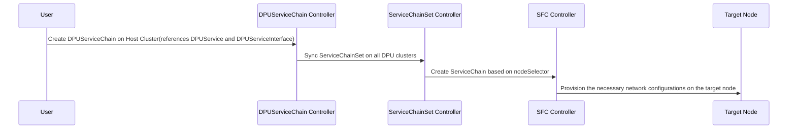

# Working with DPUServiceChain Custom Resource
This document describes how to use DPUServiceChain in DPF.

# Introduction 

The purpose of DPUServiceChain is to allow user to define how to steer traffic on DPU through DPUServiceInterfaces.The following controllers are used internally to achieve this.

1) User creates DPUServiceChain, servicechaincontroller consumes it on the host cluster.
2) ServiceChainSet is created on DPU clusters
3) ServiceChain is created for individual nodes based on nodeSelector.
4) SFC controller provisions the necessary network configurations on DPU.



# How to Use DPUServiceChain
DPUServiceChain example:

The following YAML manifest defines a DPUServiceChain named `example-chain` and refers to one DPUService named `example-service` and 4 DPUServiceInterfaces. DPUServiceChain will define how the traffic will flow through those DPUServiceInterfaces.

`DPUServiceInterfaces`

```yaml
apiVersion: svc.dpu.nvidia.com/v1alpha1
kind: DPUServiceInterface
metadata:
  name: p0
  namespace: dpf-operator-system
spec:
  template:
    spec:
      template:
        metadata:
          labels:
            uplink: "p0"
        spec:
          interfaceType: physical
          physical:
            interfaceName: p0
```

```yaml
apiVersion: svc.dpu.nvidia.com/v1alpha1
kind: DPUServiceInterface
metadata:
  name: pf0hpf
  namespace: dpf-operator-system
spec:
  template:
    spec:
      nodeSelector:
        matchExpressions:
          - key: kubernetes.io/os
            operator: In
            values:
              - "linux"
      template:
        metadata:
          labels:
            uplink: "pf0hpf"
        spec:
          interfaceType: pf
          pf:
            pfID: 0
```

```yaml
apiVersion: svc.dpu.nvidia.com/v1alpha1
kind: DPUServiceInterface
metadata:
  name: eth1
  namespace: dpf-operator-system
spec:
  template:
    spec:
      template:
        metadata:
          labels:
            svc.dpu.nvidia.com/interface: "eth1"
            svc.dpu.nvidia.com/service: example-service
        spec:
          interfaceType: service
          service:
            serviceID: example-service
            network: mybrsfc
            interfaceName: eth1
```

```yaml
apiVersion: svc.dpu.nvidia.com/v1alpha1
kind: DPUServiceInterface
metadata:
  name: eth2
  namespace: dpf-operator-system
spec:
  template:
    spec:
      template:
        metadata:
          labels:
            svc.dpu.nvidia.com/interface: "eth2"
            svc.dpu.nvidia.com/service: example-service
        spec:
          interfaceType: service
          service:
            serviceID: example-service
            network: mybrsfc
            interfaceName: eht2
```

`DPUService`

```yaml
apiVersion: svc.dpu.nvidia.com/v1alpha1
kind: DPUService
metadata:
  name: example-service
  namespace: dpf-operator-system
spec:
  serviceID: example-service
  interfaces:
    - eth1
    - eth2
  helmChart:
    source:
      repoURL: https://helm.ngc.nvidia.com/nvidia/doca
      version: 1.0.1
      chart: example-service
    values:
      resources:
        memory: 6Gi
```

`DPUServiceChain`
```yaml
apiVersion: svc.dpu.nvidia.com/v1alpha1
kind: DPUServiceChain
metadata:
  name: example-chain
  namespace: dpf-operator-system
spec:
  template:
    spec:
      template:
        spec:
          switches:
            - ports:
              - serviceInterface:
                  matchLabels:
                    uplink: p0
              - serviceInterface:
                  matchLabels:
                    svc.dpu.nvidia.com/service: example-service
                    svc.dpu.nvidia.com/interface: eth1
            - ports:
              - serviceInterface:
                   matchLabels:
                    svc.dpu.nvidia.com/service: example-service
                    svc.dpu.nvidia.com/interface: eth2
              - serviceInterface:
                  matchLabels:
                    uplink: pf0hpf
```

Let's break it down step by step.

1) There are 4 DPUServiceInterfaces
i) uplink port p0
ii) uplink port pf0hpf on host
iii) service interface eth1
iv) service interface eth2

2) There is one DPUService
i) example-service which has two interfaces eth1 and eth2

3) There is one DPUServiceChain
i) exmaple-chain

`p0 --> eth1 --> eth2 --> pf0hpf`

In the above example, traffic will flow from uplink port p0 to example DPU service's eth1 iface. From eth1 iface, it will go to eth2 iface(eth1->eth2 is handled by the service itself and not by the chain) and then to uplink port pf0hpf on the host. 