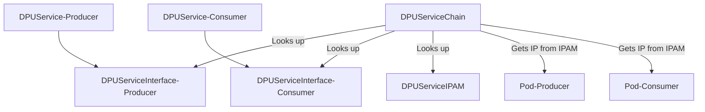

# Working with the DPUServiceIPAM Custom Resource

<!-- toc -->
- [Modes](#modes)
- [Created Child Custom Resources](#created-child-custom-resources)
  - [Split subnet into chunk per node](#split-subnet-into-chunk-per-node)
  - [Split CIDR into subnet per node](#split-cidr-into-subnet-per-node)
- [Consuming IPAM in <code>DPUServiceChain</code>](#consuming-ipam-in-dpuservicechain)
- [Limitations](#limitations)
<!-- /toc -->

This document describes how a user can work with the `DPUServiceIPAM` Custom Resource. A `DPUServiceIPAM` object is
responsible for doing the IP Address Management in the DPU cluster, IPs which the rest of the DPF objects like
`DPUServiceChain` can consume. Under the hood, this object is using [nvidia-k8s-ipam](https://github.com/Mellanox/nvidia-k8s-ipam).

## Modes

The `DPUServiceIPAM` can operate in 2 distict modes:

- `.spec.ipv4Subnet`: Share a subnet across all the nodes by splitting the subnet in smaller unique chunks per node. In
  this mode, there is a single gateway for the whole subnet the `DPUServiceIPAM` is managing.
- `.spec.ipv4Network`: Split a CIDR into a unique subnet per node. In this mode, each node has its own gateway.

## Created Child Custom Resources

As previously mentioned, the `DPUServiceIPAM` controller leverages the [nvidia-k8s-ipam](https://github.com/Mellanox/nvidia-k8s-ipam)
project. The controller creates either a [CIDRPool](https://github.com/Mellanox/nvidia-k8s-ipam?tab=readme-ov-file#cidrpool-cr)
or a [IPPool](https://github.com/Mellanox/nvidia-k8s-ipam#ippool-cr) Custom Resource in the underlying DPU cluster
depending on the mode the `DPUServiceIPAM` is configured.

Switching from one mode to another leads to the previous Custom Resource being deleted and the new one to be created.

Removing the pool, doesn't affect running Pods. Readding the same pool, assuming that there was no node addition/deletion
in the DPU cluster, is a safe operation and will not lead to duplicate IP consumption by Pods.

In order to avoid duplicating docs related to the usage of each field, take a look at the [API Documentation](../api.md#dpuserviceipam).
Note that there are additional fields that can be used but in the interest of simplicity, this guide uses only the
required ones.

### Split subnet into chunk per node

To split a subnet into chunks per node, all of them sharing the same gateway, we have to create a Custom Resource like
this:

```yaml
apiVersion: svc.dpu.nvidia.com/v1alpha1
kind: DPUServiceIPAM
metadata:
  name: example-pool1
spec:
  metadata:
    labels:
      # Specifying a label here enables us to make use of this object in DPUServiceChain.
      svc.dpu.nvidia.com/pool: example-pool1
  ipv4Subnet:
    subnet: "192.168.0.0/20"
    gateway: "192.168.0.1"
    perNodeIPCount: 256
```

This configuration creates chunks of `256` available IPs for each node with gateway `192.168.0.1` for all of those
nodes.

### Split CIDR into subnet per node

To split a CIDR into a subnet per node each having a distinct gateway, we have to create a Custom Resource like this:

```yaml
apiVersion: svc.dpu.nvidia.com/v1alpha1
kind: DPUServiceIPAM
metadata:
  name: example-pool1
spec:
  metadata:
    labels:
      # Specifying a label here enables us to make use of this object in DPUServiceChain.
      svc.dpu.nvidia.com/pool: example-pool1
  ipv4Network:
    network: "192.168.0.0/20"
    # Optional field that usually makes sense to set, unless we use a point to point network (/31) and we want to use
    # both IPs.
    gatewayIndex: 1
    prefixSize: 24
```

This configuration creates subnets of size `/24` for each node with gateway the first IP in that subnet.

## Consuming IPAM in `DPUServiceChain`

For our workload to consume an IP from the IPAM we have installed in the cluster, we need to create a `DPUServiceChain`
and reference the IPAM object via labels. Below is an example of 2 fake `DPUServices` that are part of the same chain
and each of them require an IP address from a particular pool. We won't go into details on the `DPUServiceInterface`
or `DPUService` objects here, but we provide reference examples to ensure that the `DPUServiceChain` is understandable.

The following diagram may help illustrate the objects that are involved.



First, we need to create the `DPUServiceIPAM`. We can create the one specified in
[Split subnet into chunk per node](#split-subnet-into-chunk-per-node).

Order of applying those resources doesn't matter, but in the interest of making the flow easier to understand, we apply
some order.

Then, we apply the `DPUService` and its `DPUServiceInterface` resources for each of the service:

```yaml
---
apiVersion: svc.dpu.nvidia.com/v1alpha1
kind: DPUServiceInterface
metadata:
  name: producer
spec:
  template:
    spec:
      template:
        metadata:
          labels:
            svc.dpu.nvidia.com/interface: app-iface
            svc.dpu.nvidia.com/service: producer
        spec:
          interfaceType: service
          service:
            interfaceName: app-iface
            network: mybrsfc
            serviceID: producer
---
apiVersion: svc.dpu.nvidia.com/v1alpha1
kind: DPUService
metadata:
  name: producer
spec:
  serviceID: producer
  helmChart:
    source:
      repoURL: https://example.com/charts
      path: producer
      version: v0.0.1
    values:
      container1:
        resources:
          requests:
            nvidia.com/sf: 1
  interfaces:
  - producer


---
apiVersion: svc.dpu.nvidia.com/v1alpha1
kind: DPUServiceInterface
metadata:
  name: consumer
spec:
  template:
    spec:
      template:
        metadata:
          labels:
            svc.dpu.nvidia.com/interface: app-iface
            svc.dpu.nvidia.com/service: consumer
        spec:
          interfaceType: service
          service:
            interfaceName: app-iface
            network: mybrsfc
            serviceID: consumer
---
apiVersion: svc.dpu.nvidia.com/v1alpha1
kind: DPUService
metadata:
  name: consumer
spec:
  serviceID: consumer
  helmChart:
    source:
      repoURL: https://example.com/charts
      path: consumer
      version: v0.0.1
    values:
      worker:
        resources:
          requests:
            nvidia.com/sf: 1
  interfaces:
  - consumer

```

Then we create the `DPUServiceChain`. In this `DPUServiceChain` we request that the 2 interfaces are part of the same
switch and each of the interfaces request an IP from the pool we have created above:

```yaml
---
apiVersion: svc.dpu.nvidia.com/v1alpha1
kind: DPUServiceChain
metadata:
  name: producer-consumer
spec:
  template:
    spec:
      template:
        spec:
          switches:
            - ports:
              - serviceInterface:
                  matchLabels:
                    svc.dpu.nvidia.com/interface: app-iface
                    svc.dpu.nvidia.com/service: producer
                  ipam:
                    # Reference to the label we have specified in the DPUServiceIPAM
                    matchLabels:
                      svc.dpu.nvidia.com/pool: pool1
              - serviceInterface:
                  matchLabels:
                    svc.dpu.nvidia.com/interface: app-iface
                    svc.dpu.nvidia.com/service: consumer
                  ipam:
                    # Reference to the label we have specified in the DPUServiceIPAM
                    matchLabels:
                      svc.dpu.nvidia.com/pool: pool1
```

Assuming that the Helm Charts above are valid and the respect the DPF Contract, the outcome of the above resources will
be that each node on the DPU cluster will have 2 Pods, one consumer and one producer. These Pods will have 2 interfaces
each, one primary and a secondary using a Scalable Function (SF). The SFs will have an IP configured on them from the
pool defined above, from the chunk that is allocated on the node.

## Limitations

- `DPUServiceIPAM` CRs must be created in `dpf-operator-system` namespace to take effect.
