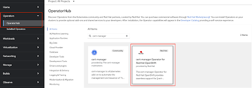

# Prerequisites
* oc (OpenShift Client) 
* Cert Manager
* Support for PersistentVolumes

A [CSI Driver](https://kubernetes.io/docs/concepts/storage/volumes/#csi) is also recommended, it is used to provide PersistentVolumes for the etcd pods, which are deployed during Kamaji set-up. If there is no CSI Driver available in the cluster, you will have to create [PersistentVolumes](https://kubernetes.io/docs/concepts/storage/persistent-volumes/) manually. Here is a sample PV:
```yaml
apiVersion: v1
kind: PersistentVolume
metadata:
  name: pv-10g
spec:
  capacity:
    storage: 10Gi
  volumeMode: Filesystem
  accessModes:
    - ReadWriteOnce
  hostPath:
    path: "/opt/etcd/data"
```
> **Note**: there will be 3 etcd pods created, so you need 3 PVs

# Install Kamaji Controller
1. Set variable

```bash
export KAMAJI_NAMESPACE=kamaji-system
```

2. Submit [SCC (Security Context Constraints)](https://docs.openshift.com/container-platform/4.14/authentication/managing-security-context-constraints.html)

```bash
cat << EOF > scc-kamaji-setup.yaml
allowHostDirVolumePlugin: true
allowHostIPC: true
allowHostNetwork: true
allowHostPID: true
allowHostPorts: true
allowPrivilegeEscalation: true
allowPrivilegedContainer: true
allowedCapabilities:
- '*'
allowedUnsafeSysctls:
- '*'
apiVersion: security.openshift.io/v1
defaultAddCapabilities: null
fsGroup:
  type: RunAsAny
groups: []
kind: SecurityContextConstraints
metadata:
  name: kamaji-setup
priority: 99
readOnlyRootFilesystem: false
requiredDropCapabilities: null
runAsUser:
  type: RunAsAny
seLinuxContext:
  type: RunAsAny
seccompProfiles:
- '*'
supplementalGroups:
  type: RunAsAny
users:
- system:serviceaccount:${KAMAJI_NAMESPACE}:etcd
- system:serviceaccount:${KAMAJI_NAMESPACE}:default
volumes:
- '*'
EOF

oc create -f scc-kamaji-setup.yaml
```

3. Configure SELinux for local volumes

Kamaji deploys an etcd cluster as its backend storage, with a PVC for each etcd pod. If you use local volumes as PersistentVolumes, you need 3 PVs, and the following SELinux context must be configured on each node.
* For RHEL prior to version 7.5:
```bash
mkdir -p ${path_to_your_volume}
semanage fcontext -a -t svirt_sandbox_file_t ${path_to_your_volume}
restorecon -v ${path_to_your_volume}
```

* For RHEL starting with version 7.5:
```bash
mkdir -p ${path_to_your_volume}
semanage fcontext -a -t container_file_t ${path_to_your_volume}
restorecon -v ${path_to_your_volume}
```
> **Note**: Please ensure that there are **no symbolic links** in `${path_to_your_volume}`. For example, if you are using /opt/data as the local volume and /opt is a symbolic link to /var/opt, then the `${path_to_your_volume}` should be /var/opt/data

Refer to [this link](https://docs.openshift.com/container-platform/4.14/authentication/managing-security-context-constraints.html) for more information.

4. Install Kamaji with helm

You need a docker hub account to pull images without having rate limit errors. You can create your personal account [here](https://hub.docker.com/signup). Once you have your account, you can use either your account password or a read-only access token as the value of the environment variable down below.

```bash
export DOCKER_HUB_NAME=YOUR_DOCKER_HUB_ACCOUNT_NAME
export DOCKER_HUB_PASSWORD=YOUR_DOCKER_HUB_ACCOUNT_PASSWORD_OR_TOKEN
oc create namespace ${KAMAJI_NAMESPACE}
oc create secret docker-registry kamaji -n ${KAMAJI_NAMESPACE} --docker-server=docker.io --docker-username=${DOCKER_HUB_NAME} --docker-password=${DOCKER_HUB_PASSWORD}
helm repo add clastix https://clastix.github.io/charts
helm repo update
helm install kamaji clastix/kamaji \
        -n kamaji-system \
        --set imagePullSecrets[0].name=kamaji
```

> **Note**:
> * Make sure you have a CSI Driver configured as [default StorageClass](https://docs.openshift.com/container-platform/4.14/authentication/managing-security-context-constraints.html) in the cluster
> * See the Cleanup section before retrying an aborted installation.

5. Make sure the Kamaji controller and etcd pods are Running
```bash
oc -n kamaji-system get pods
NAME                         READY   STATUS      RESTARTS      AGE
etcd-0                       1/1     Running     0             50s
etcd-1                       1/1     Running     0             60s
etcd-2                       1/1     Running     0             90s
kamaji-7949578bfb-lj44p      1/1     Running     0             12s
```


# Create Tenant Cluster
## Tenant Control Plane
1. Set variables
```bash
export TENANT_NAMESPACE=tenant-00-ns
export TENANT_NAME=tenant-00
export TENANT_DOMAIN=clastix.labs
export TENANT_VERSION=v1.29.0
export TENANT_PORT=6443 # port used to expose the tenant api server
export TENANT_PROXY_PORT=8132 # port used to expose the konnectivity server
export TENANT_POD_CIDR=10.244.0.0/16
export TENANT_SVC_CIDR=10.96.0.0/16
export TENANT_DNS_SERVICE=10.96.0.10
```

> **Note**: You should adjust the variables to your environment.

2. Submit SCC
```bash
cat << EOF > scc-${TENANT_NAMESPACE}.yaml
allowHostDirVolumePlugin: true
allowHostIPC: true
allowHostNetwork: true
allowHostPID: true
allowHostPorts: true
allowPrivilegeEscalation: true
allowPrivilegedContainer: true
allowedCapabilities:
- '*'
allowedUnsafeSysctls:
- '*'
apiVersion: security.openshift.io/v1
defaultAddCapabilities: null
fsGroup:
  type: RunAsAny
groups: []
kind: SecurityContextConstraints
metadata:
  name: ${TENANT_NAMESPACE}
priority: 99
readOnlyRootFilesystem: false
requiredDropCapabilities: null
runAsUser:
  type: RunAsAny
seLinuxContext:
  type: RunAsAny
seccompProfiles:
- '*'
supplementalGroups:
  type: RunAsAny
users:
- system:serviceaccount:${TENANT_NAMESPACE}:default
volumes:
- '*'
EOF

oc create -f scc-${TENANT_NAMESPACE}.yaml
```

3. Submit TenantControlPlane
```bash
cat > ${TENANT_NAMESPACE}-${TENANT_NAME}-tcp.yaml <<EOF
apiVersion: kamaji.clastix.io/v1alpha1
kind: TenantControlPlane
metadata:
  name: ${TENANT_NAME}
  namespace: ${TENANT_NAMESPACE}
  labels:
    tenant.clastix.io: ${TENANT_NAME}
spec:
  dataStore: default
  controlPlane:
    deployment:
      replicas: 3
      additionalMetadata:
        labels:
          tenant.clastix.io: ${TENANT_NAME}
      extraArgs:
        apiServer: []
        controllerManager: []
        scheduler: []
      resources:
        apiServer:
          requests:
            cpu: 250m
            memory: 512Mi
          limits: {}
        controllerManager:
          requests:
            cpu: 125m
            memory: 256Mi
          limits: {}
        scheduler:
          requests:
            cpu: 125m
            memory: 256Mi
          limits: {}
    service:
      additionalMetadata:
        labels:
          tenant.clastix.io: ${TENANT_NAME}
      serviceType: ClusterIP
  kubernetes:
    version: ${TENANT_VERSION}
    kubelet:
      cgroupfs: systemd
    admissionControllers:
      - ResourceQuota
      - LimitRanger
  networkProfile:
    port: ${TENANT_PORT}
    certSANs:
    - ${TENANT_NAME}.${TENANT_DOMAIN}
    serviceCidr: ${TENANT_SVC_CIDR}
    podCidr: ${TENANT_POD_CIDR}
    dnsServiceIPs:
    - ${TENANT_DNS_SERVICE}
  addons:
    coreDNS: {}
    kubeProxy: {}
    konnectivity:
      server:
        port: ${TENANT_PROXY_PORT}
        resources:
          requests:
            cpu: 100m
            memory: 128Mi
          limits: {}
EOF

oc create ns ${TENANT_NAMESPACE}
oc -n ${TENANT_NAMESPACE} apply -f ${TENANT_NAMESPACE}-${TENANT_NAME}-tcp.yaml
```

4. Check the created resources and when ready it will look similar to the following
```bash
oc -n ${TENANT_NAMESPACE} get tcp,deploy,pods,svc

NAME                           VERSION   STATUS   CONTROL-PLANE ENDPOINT   KUBECONFIG                   DATASTORE   AGE
tenantcontrolplane/tenant-00   v1.25.2   Ready    172.30.127.238:6443      tenant-00-admin-kubeconfig   default     2m20s

NAME                        READY   UP-TO-DATE   AVAILABLE   AGE
deployment.apps/tenant-00   3/3     3            3           118s

NAME                             READY   STATUS    RESTARTS   AGE
pod/tenant-00-58847c8cdd-7hc4n   4/4     Running   0          82s
pod/tenant-00-58847c8cdd-ft5xt   4/4     Running   0          82s
pod/tenant-00-58847c8cdd-shc7t   4/4     Running   0          82s

NAME                TYPE           CLUSTER-IP      EXTERNAL-IP      PORT(S)                         AGE
service/tenant-00   ClusterIP      172.30.127.238  <none>           6443/TCP,8132/TCP               2m20s
```

## Working with Tenant Control Plane
1. Collect the external IP address of the tenant control plane and check it out
```bash
TENANT_ADDR=$(oc -n ${TENANT_NAMESPACE} get svc ${TENANT_NAME} -o jsonpath="{.spec.clusterIP}")
curl -k https://${TENANT_ADDR}:${TENANT_PORT}/healthz
curl -k https://${TENANT_ADDR}:${TENANT_PORT}/version
```

2. The kubeconfig required to access the Tenant Control Plane is stored in a secret
```bash
oc get secrets -n ${TENANT_NAMESPACE} ${TENANT_NAME}-admin-kubeconfig -o jsonpath="{.data.admin\.conf}" \
  | base64 --decode \
  > ${TENANT_NAMESPACE}-${TENANT_NAME}.kubeconfig

oc --kubeconfig=${TENANT_NAMESPACE}-${TENANT_NAME}.kubeconfig cluster-info

Kubernetes control plane is running at https://172.30.127.238:6443
CoreDNS is running at https://172.30.127.238:6443/api/v1/namespaces/kube-system/services/kube-dns:dns/proxy
```
> **Note**: This kubeconfig is granted admin permission, keep it carefully.


3. Check out how the Tenant Control Plane advertises itself to workloads
```bash
oc --kubeconfig=${TENANT_NAMESPACE}-${TENANT_NAME}.kubeconfig get svc

NAMESPACE     NAME         TYPE        CLUSTER-IP   EXTERNAL-IP   PORT(S)   AGE
default       kubernetes   ClusterIP   10.96.0.1    <none>        443/TCP   6m

oc --kubeconfig=${TENANT_NAMESPACE}-${TENANT_NAME}.kubeconfig get ep

NAME         ENDPOINTS             AGE
kubernetes   172.30.127.238:6443   18m
```
> **Note**: Make sure the CLUSTER-IP is in the range of `${TENANT_SVC_CIDR}` and ENDPOINTS is `${TENANT_ADDR}:${TENANT_PORT}`.

# Cleanup
## Delete Tenant Cluster
1. First, remove the worker nodes joined the tenant control plane
```bash
oc --kubeconfig=${TENANT_NAMESPACE}-${TENANT_NAME}.kubeconfig delete nodes --all 

HOSTS=(${WORKER0} ${WORKER1} ${WORKER2})
for i in "${!HOSTS[@]}"; do
  HOST=${HOSTS[$i]}
  ssh ${USER}@${HOST} -t 'sudo kubeadm reset -f';
  ssh ${USER}@${HOST} -t 'sudo rm -rf /etc/cni/net.d';
  ssh ${USER}@${HOST} -t 'sudo systemctl reboot';
done
```

2. Delete the tenant control plane from Kamaji
```bash
oc delete -f ${TENANT_NAMESPACE}-${TENANT_NAME}-tcp.yaml
```

## Uninstall Kamaji
1. Uninstall the Kamaji controller by removing the Helm release
```bash
helm uninstall kamaji -n kamaji-system
```

2. The default datastore installed three etcd replicas with persistent volumes, so remove the PersistentVolumeClaims resources:
```bash
kubectl -n kamaji-system delete pvc --all
```

3. delete the custom resources:

```bash
oc delete crd tenantcontrolplanes.kamaji.clastix.io
oc delete crd datastores.kamaji.clastix.io
```


4. In case of a broken installation, manually remove the hooks installed by Kamaji:
```bash
oc delete ValidatingWebhookConfiguration kamaji-validating-webhook-configuration
oc delete MutatingWebhookConfiguration kamaji-mutating-webhook-configuration
```

# Reference
## Cert Manager
### Install 
1. Login to OpenShift cluster console and install cert-manager (Red Had edition)
 

2. Verify that cert-manager pods are up and running
```bash
oc get pods -n cert-manager
NAME                                       READY   STATUS    RESTARTS   AGE
cert-manager-bd7fbb9fc-wvbbt               1/1     Running   0          3m39s
cert-manager-cainjector-56cc5f9868-7g9z7   1/1     Running   0          4m5s
cert-manager-webhook-d4f79d7f7-9dg9w       1/1     Running   0          4m9s
```

### Uninstall
* Navigate to Operators > Installed Operators
* Select “All Projects” from the dropdown menu at the top of the screen
* Find the cert-manager Operator
* Click the three dots on the right side of the screen > Uninstall Operator


